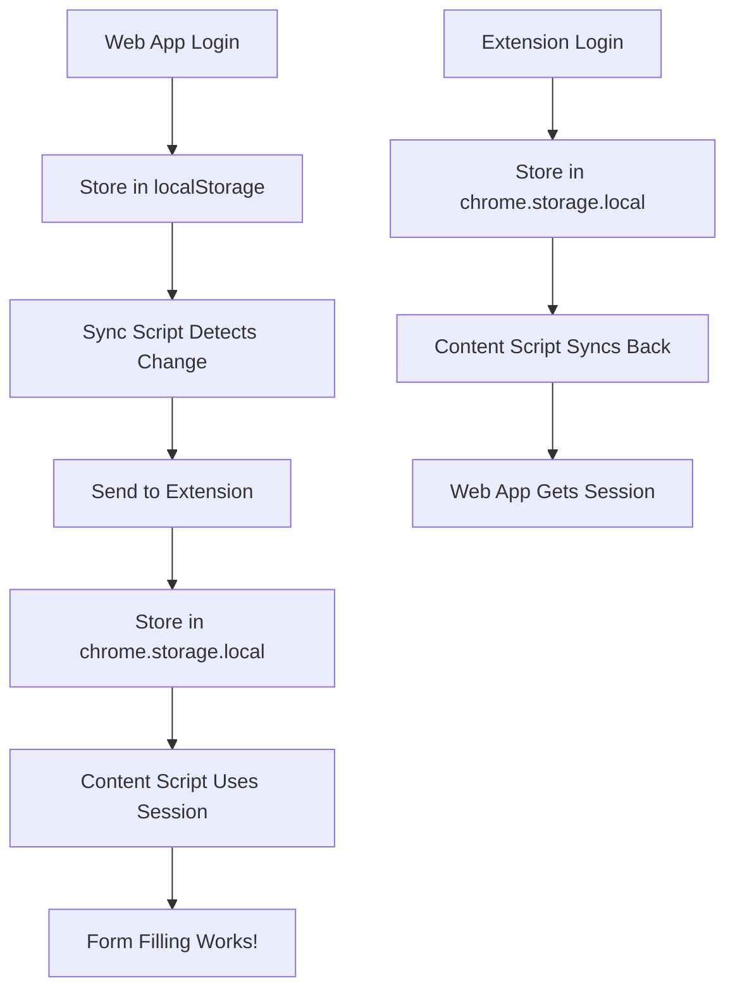

# 🔄 Session Synchronization Guide

## Problem Solved

Your browser extension and web application were running on different domains, preventing them from sharing session data. Users had to login separately in both places, creating confusion and a poor user experience.

## Solution Overview

We've implemented a **bidirectional session synchronization system** that automatically syncs login sessions between:

- **Browser Extension** (chrome-extension://)
- **Web Application** (http://localhost:5173)
- **Job Application Sites** (any website where forms are filled)

## 🎯 How It Works



## 🔧 Implementation Details

### 1. Content Script Enhancement

**File:** `content-script.js`

- Added `syncWithWebApp()` function that checks both extension and web app sessions
- Automatically detects when user is on web app domain (localhost:5173)
- Syncs session data bidirectionally
- Listens for web app login/logout events

### 2. Background Script Updates

**File:** `background.js`

- Added `handleSyncSession()` to process sync requests
- Added external message handling for web app communication
- Supports both internal (extension) and external (web app) session sync

### 3. Web App Sync Script

**File:** `web-app-sync.js`

- Monitors localStorage for session changes
- Automatically notifies extension when login/logout occurs
- Provides manual sync functions for web app integration
- Handles cross-origin communication safely

### 4. Manifest Updates

**File:** `manifest.json`

- Added `externally_connectable` permission for localhost communication
- Allows web app to send messages to extension

## 🚀 Usage Instructions

### For Users

1. **Login anywhere** - Extension popup, web app, or let the system auto-sync
2. **Form filling works immediately** - No need to login again
3. **Automatic synchronization** - Sessions stay in sync across all domains

### For Web App Integration

Include the sync script in your web app:

```html
<!-- Add to your web app's HTML -->
<script src="web-app-sync.js"></script>
```

The script will automatically:

- Monitor localStorage for session changes
- Sync with browser extension
- Handle login/logout events

### Manual Sync (Optional)

```javascript
// In your web app after login
window.syncSessionWithExtension({
  sessionId: "your-session-id",
  userId: "your-user-id",
  email: "user@example.com",
});
```

## 🧪 Testing

### Test Page

Use `test-sync.html` to test the synchronization:

1. Open in browser: `file:///path/to/test-sync.html`
2. Click "Simulate Login"
3. Check that extension receives the session
4. Test form filling on the same page

### Manual Testing Steps

1. **Test Extension → Web App Sync:**

   - Login through extension popup
   - Navigate to web app
   - Verify session is available

2. **Test Web App → Extension Sync:**

   - Login through web app
   - Navigate to job application site
   - Click on form field
   - Verify AI assistant appears and works

3. **Test Cross-Domain Form Filling:**
   - Login once (anywhere)
   - Visit job application sites
   - Test form filling functionality
   - Verify consistent behavior

## 🔍 Debugging

### Console Logs

The system provides detailed console logs:

```javascript
// Extension logs
🔄 Attempting to sync session with web app...
📍 On web app domain, checking for session...
✅ Found web app session, syncing to extension...

// Web app logs
🔄 Session state changed: {sessionId: "...", userId: "..."}
✅ Login detected and synced to extension
```

### Check Session Data

```javascript
// In browser console (any domain)
chrome.storage.local.get(["sessionId", "userId", "email"], console.log);

// In web app console
console.log("Web app session:", {
  sessionId: localStorage.getItem("sessionId"),
  userId: localStorage.getItem("userId"),
  email: localStorage.getItem("email"),
});
```

## 🔒 Security Considerations

### Safe Cross-Origin Communication

- Only allows communication with localhost domains
- Uses Chrome's secure messaging API
- No sensitive data exposed to untrusted domains

### Session Validation

- All sessions validated server-side
- Extension storage is secure and isolated
- Automatic cleanup of invalid sessions

## 📋 Files Modified

1. **`content-script.js`** - Added sync functions and web app detection
2. **`background.js`** - Added external message handling and sync logic
3. **`manifest.json`** - Added external connectivity permissions
4. **`web-app-sync.js`** - New sync script for web app integration
5. **`test-sync.html`** - Test page for validation

## 🎉 Benefits

### For Users

- ✅ **Single Login** - Login once, works everywhere
- ✅ **Seamless Experience** - No authentication confusion
- ✅ **Automatic Sync** - No manual intervention needed

### For Developers

- ✅ **Easy Integration** - Just include the sync script
- ✅ **Flexible Authentication** - Works with any session system
- ✅ **Robust Error Handling** - Graceful fallbacks and recovery

## 🔧 Troubleshooting

### Common Issues

1. **"Extension not available" error**

   - Ensure extension is installed and enabled
   - Check browser console for extension errors
   - Verify manifest.json permissions

2. **Session not syncing**

   - Check localStorage contains sessionId and userId
   - Verify web app includes sync script
   - Check browser console for sync logs

3. **Form filling not working**
   - Confirm session is synced (check console logs)
   - Verify API endpoint is accessible
   - Check network tab for API call errors

### Debug Commands

```javascript
// Check if sync system is loaded
console.log("Sync available:", !!window.webAppSync);

// Manual sync check
window.webAppSync?.checkSession();

// Check extension availability
window.webAppSync?.isExtensionAvailable();
```

## 🎯 Next Steps

1. **Deploy the updated extension** with sync capabilities
2. **Integrate sync script** into your web app
3. **Test thoroughly** across different domains
4. **Monitor logs** to ensure smooth operation

The session synchronization system is now ready for production use! 🚀
